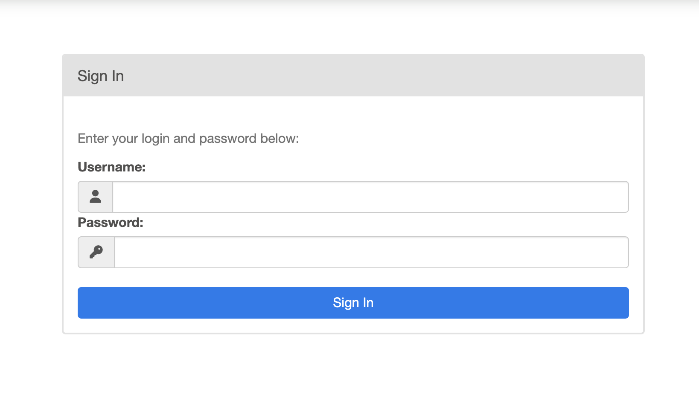
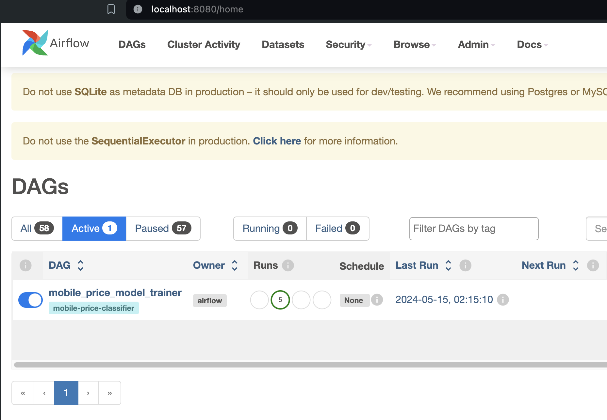

# Build ML Pipeline Using Airflow

Medium Blog: [here](https://medium.com/@jadhav-pritish/building-ml-pipelines-with-airflow-01bc28ac021c?sk=f87d9c67f5038ee8437590c17662417d)

## Pre-requisites:

* To setup the Virtualenv, install poetry using pip:

``` pip install poetry```

More info on poetry: [here](https://pypi.org/project/poetry/)

* Note that this repository uses python 3.11. I would recommend using [pyenv](https://pypi.org/project/pyenv/) for installing and switching between multiple python versions
```angular2html
pip install pyenv
pyenv versions 
# If python 3.11 is missing, run the following command
pyenv install 3.11
# use python 3.11 for this specific project. Ensure that you are running the following command from the project directory. 
pyenv local 3.11
```

## Setting up the Virtual Environment:

To setup a virtualenv with all the necessary python dependencies install, run:

```angular2html
make init
```

## Run Airflow locally

To spin up a local instance of Airflow, run:

```make run-local```

This will do three things:

* It will initialize the Airflow metastore database. The default choice is SQLite.
* It will create a user with username: `admin` and password `admin`. These credentials can be used to login into the local Airflow instance. 
* It will spin up Airflow Webserver and Airflow Scheduler.


Open Airflow Locally:

Head over to the browser and enter: `http://localhost:8080/`


Enter username as `admin` and password as `admin` to login. 

After logging in, you should be able to see the `mobile_price_model_trainer` DAG under the `Active` Tab. Click into it to trigger the DAG. 

